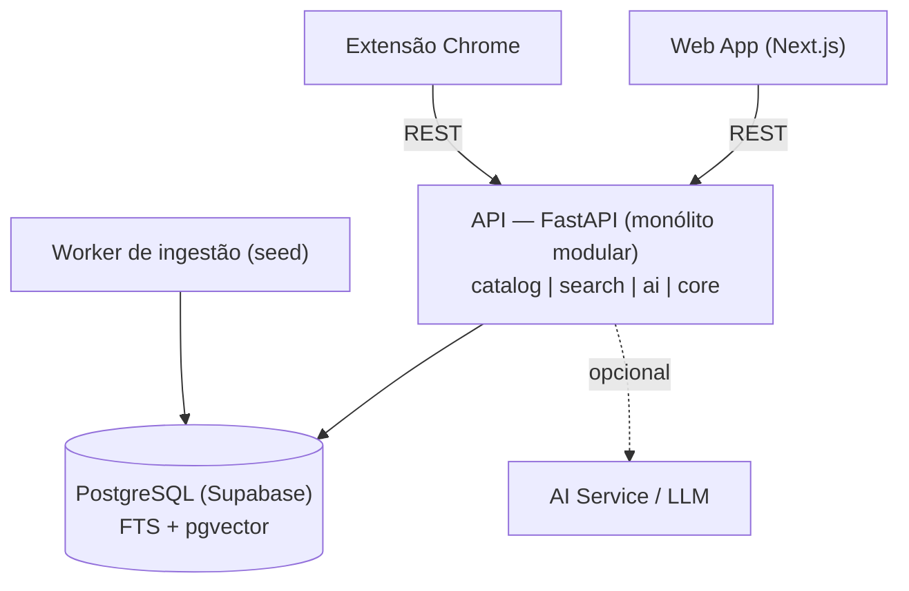

# Arquitetura — MVP

> Consolida os ADRs [0001](../adr/0001-aquisicao-de-dados.md), [0002](../adr/0002-datastore-postgres-only.md), [0003](../adr/0003-monolito-modular.md), [0004](../adr/0004-deploy-free-tier.md).

## Visão (camadas)

A IA é chamada **apenas quando habilitada**; o caminho crítico (busca/comparação/ranking) opera sem ela.

## Componentes

| Componente | Tecnologia | Responsabilidades |
| --- | --- | --- |
| Web App | Next.js + TS + Tailwind + shadcn/ui | UI de busca, resultados, comparação |
| Extensão | Manifest V3 | Lê query da SERP, injeta popup; ativa só em categoria coberta |
| API | FastAPI (monólito modular) | Endpoints, intenção, busca, ranking, comparação |
| Worker | Python (job/CLI) | Ingestão do seed |
| Banco | PostgreSQL (Supabase) | Persistência, FTS, pgvector |
| AI Service | Interface + provider opcional | Explicações via LLM (fallback determinístico) |

## Módulos internos da API

| Módulo | Responsabilidade |
| --- | --- |
| `catalog` | Produtos, categorias, marcas, specs, ofertas, histórico; repositórios |
| `search` | Parser de intenção, providers de busca (FTS/vetorial), ranking |
| `ai` | Interface de IA + providers (determinístico/LLM) |
| `core` | Config, banco, logging, erros |

## Contratos de interface

| Interface | Operação | MVP | Evolução |
| --- | --- | --- | --- |
| `IntentParser` | `parse(query) -> Intent` | Regras | LLM opcional |
| `SearchProvider` | `search(intent, filtros, pag) -> [Hit]` | Postgres FTS | OpenSearch |
| `VectorProvider` | `embed`/`search` | pgvector + modelo local | Qdrant |
| `RankingService` | `rank(hits, intent)` | Determinístico | Score aprendido |
| `AIService` | `explain(contexto)` | Determinístico | LLM provider |
| `IngestionSource` | `fetch() -> [raw]` | Seed versionado | APIFY/APIs |

## Endpoints REST (MVP)

| Método | Rota | Descrição |
| --- | --- | --- |
| GET | `/health` | Healthcheck |
| GET | `/search` | `q, category, price_max, brand, sort, page` |
| POST | `/compare` | `{ product_ids: [...] }` (mesma categoria) |
| GET | `/products/{id}` | Detalhe: specs + ofertas |
| GET | `/categories` | Categorias cobertas (extensão) |

## Como atende os RNFs

| RNF | Como |
| --- | --- |
| Performance | FTS indexado; ranking em memória sobre conjunto reduzido |
| Sem cold start | Host sem spin-down + keep-alive no Supabase |
| Custo | Free-tier; um banco; embeddings locais |
| Reprodutibilidade | Docker Compose; seed versionado |
| Observabilidade | Logging estruturado com correlação |
| Manutenibilidade | Monólito modular + interfaces |
| Portabilidade de IA | `AIService` plugável |
| Escalabilidade | `SearchProvider`/`VectorProvider` trocáveis |

## Deploy

| Ambiente | Onde |
| --- | --- |
| Frontend | Vercel |
| Backend | Host sem cold start (Fly.io / HF — a confirmar) |
| Banco | Supabase (FTS + pgvector) + keep-alive |
| Dev local | Docker Compose |

## Estratégia de evolução (gatilho → mudança)

| Gatilho | Mudança | ADR |
| --- | --- | --- |
| Catálogo amplo/atualizado | Trocar `IngestionSource` (APIFY/APIs) | 0001 |
| Recall/escala vetorial | `VectorProvider` → Qdrant | 0002 |
| Relevância avançada/facets | `SearchProvider` → OpenSearch | 0002 |
| Gargalo isolado a módulo | Extrair serviço | 0003 |
| Cold start/limites free-tier | Tier pago / consolidar provedor | 0004 |
