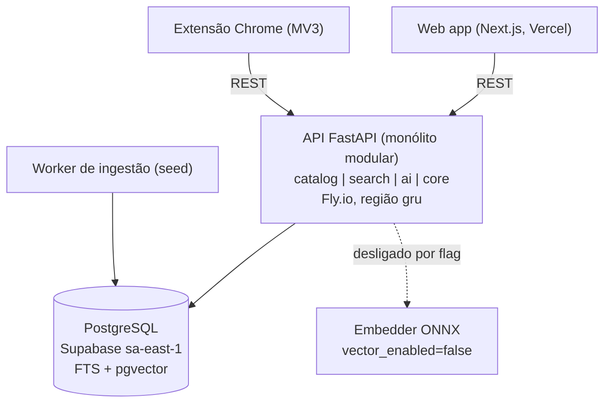

# Arquitetura

> Consolida os ADRs [0002](../adr/0002-datastore-postgres-only.md) (datastore),
> [0003](../adr/0003-monolito-modular.md) (monólito modular),
> [0007](../adr/0007-pipeline-busca-retrieval-ranking.md) (pipeline de busca),
> [0010](../adr/0010-fase-6-onde-a-ia-entra.md) (onde a IA entra) e
> [0011](../adr/0011-deploy-producao-fly-io.md) (deploy de produção).

## Visão em camadas

```mermaid
flowchart TD
  WA["Web app (Next.js, Vercel)"] -->|REST| API
  EXT["Extensão Chrome (MV3)"] -->|REST| API
  API["API FastAPI (monólito modular)<br/>catalog | search | ai | core<br/>Fly.io, região gru"] --> DB[("PostgreSQL<br/>Supabase sa-east-1<br/>FTS + pgvector")]
  WK["Worker de ingestão (seed)"] --> DB
  API -. desligado por flag .-> VEC["Embedder ONNX<br/>vector_enabled=false"]
```

O caminho crítico (busca, ranking, comparação) opera sem qualquer modelo. O embedder
existe, é testado e está desligado por flag; o racional da medição que levou a desligá-lo
está no ADR-0010 D4.1.

## Componentes

| Componente | Tecnologia | Responsabilidades |
| --- | --- | --- |
| Web app | Next.js 14, TypeScript, Tailwind, shadcn/ui | Busca, filtros, resultados, comparação, detalhe de produto |
| Extensão | Chrome Manifest V3 | Lê a query da SERP, decide cobertura localmente, injeta painel; ativa só em categoria coberta |
| API | FastAPI | Endpoints, parsing de intenção, retrieval, ranking, comparação |
| Worker | Python (CLI) | Ingestão do seed: raw, normalização, qualidade, validação, upsert |
| Banco | PostgreSQL 16 com pgvector (Supabase) | Persistência, FTS com `unaccent`, embeddings |
| AI Service | Interface com provider determinístico | Explicações. O provider de LLM foi avaliado e recusado (ADR-0010 D6.1) |

## Módulos internos da API

| Módulo | Responsabilidade |
| --- | --- |
| `catalog` | Produtos, categorias, marcas, specs, ofertas; repositório e schemas |
| `search` | Parser de intenção, providers de retrieval, ranking, comparação, log de buscas, embedding |
| `ai` | Interface de IA com fallback determinístico |
| `core` | Configuração, sessão de banco, logging com correlação por requisição |

## Contratos de interface

São `Protocol` do Python, o que permite trocar a implementação sem tocar em quem consome.

| Interface | Operação | Implementação atual | Evolução prevista |
| --- | --- | --- | --- |
| `IntentParser` | `parse(query) -> Intent` | `RuleBasedIntentParser` (regras) | LLM, condicionado ao gatilho do ADR-0010 D5 |
| `SearchProvider` | `search(intent, filtros, paginação) -> [Hit]` | `FtsSearchProvider` (Postgres FTS) | `HybridSearchProvider` (já construído, desligado); OpenSearch |
| `VectorProvider` | `embed` / `search` | `PgVectorProvider` (desligado por flag) | Qdrant |
| `RankingService` | `rank(hits, intent)` | Determinístico e ponderado | Score aprendido |
| `AIService` | `explain(contexto)` | Determinístico | Provider de LLM, recusado por medição |
| `IngestionSource` | `fetch() -> [raw]` | `SeedSource` (arquivos versionados) | Apify, APIs de marketplace |

## Pipeline de busca

Descrito em detalhe no [ADR-0007](../adr/0007-pipeline-busca-retrieval-ranking.md). Em
resumo:

1. **Intenção.** `RuleBasedIntentParser` extrai da consulta a categoria, o teto de preço,
   atributos estruturados e rótulos de `use_case` (`jogos`, `portabilidade`, `esporte`, ...),
   devolvendo também os trechos de texto que consumiu.
2. **Retrieval.** Filtros duros no banco: categoria, marca, preço, containment JSONB sobre
   `product_specs.attributes` e faixas numéricas. O pool é limitado por
   `search_candidate_pool` (200), dimensionado para cobrir o catálogo atual.
3. **Ranking.** Reordenação em memória sobre o pool, com pesos `relevance` 0.6, `price`
   0.3, `attributes` 0.1 e `preference` 2.0. O peso da preferência é maior que a soma dos
   outros de propósito: quando o usuário pede explicitamente uma marca ou uma spec, o item
   que atende precisa vencer mesmo perdendo em todo o resto.
4. **Explicabilidade.** A resposta carrega `criteria` (os critérios usados, com peso e
   rótulo) e, por item, `factors` com a contribuição de cada fator. É o que sustenta o
   RF-31.
5. **Log.** Consulta, intenção interpretada e total de resultados vão para `searches`.
   Falha ao registrar nunca derruba a busca.

Somente ofertas com `quality_status = 'valid'` entram no cálculo de preço mínimo, no
ranking e na comparação. A triagem acontece na ingestão e está no
[ADR-0012](../adr/0012-qualidade-de-ofertas-na-ingestao.md).

## Endpoints REST

| Método | Rota | Parâmetros | Descrição |
| --- | --- | --- | --- |
| GET | `/health` | | Status do app e do banco. Responde 200 sempre; o campo `db` traz `ok` ou `down` |
| GET | `/search` | `q`, `category`, `price_max`, `brand`, `attrs`, `rank_by`, `rank_brand`, `rank_spec`, `rank_spec_value`, `sort`, `page` | Busca com ranking explicado (RF-10/11/12/30/31) |
| GET | `/spec-options` | `q`, `category`, `price_max`, `brand`, `attrs` | Specs e valores disponíveis no pool atual de candidatos, para montar filtros que não levam a zero resultado |
| POST | `/compare` | corpo `{ "product_ids": [...] }` | Comparação de 2 a 4 produtos da mesma categoria (RF-20/21) |
| GET | `/products/{id}` | | Detalhe: specs completas e ofertas com link (RF-42) |
| GET | `/categories` | | Categorias com produtos. A extensão usa para decidir cobertura |
| GET | `/brands` | `category` | Marcas presentes; `?category=<slug>` restringe. O `slug` devolvido é o que `/search?brand=` consome |

`attrs` é um objeto JSON, por exemplo `{"ram_gb": 16, "anc": true}`. JSON inválido ou
objeto vazio devolvem 422.

`rank_by` aceita `relevance`, `price`, `brand` ou `spec`. Com `brand` o parâmetro
`rank_brand` é obrigatório; com `spec`, `rank_spec` e `rank_spec_value` são obrigatórios.
Faltando qualquer um deles a API devolve 422. Preferência de ranking não vira filtro duro:
ela reordena, não exclui.

Toda resposta carrega `X-Request-ID`, exposto no CORS para que o cliente consiga citar o
identificador ao reportar um erro.

## Como os RNFs são atendidos

| RNF | Como | Evidência |
| --- | --- | --- |
| RNF-01 Performance | FTS indexado, ranking em memória sobre pool limitado a 200 | Medido de fora em 18/09/2026: `/search` com mediana de 349 ms. O p95 medido dentro do servidor continua pendente |
| RNF-02 Sem cold start | `auto_stop_machines = false` e `min_machines_running = 1` no Fly, mais health check a cada 30 s | Propriedade da configuração, não estimativa (ADR-0011 D2/D4) |
| RNF-03 Custo | Free-tier em todas as camadas; um banco só; sem modelo em produção | `shared-cpu-1x` 256 MB, referência de US$1,94/mês antes do acréscimo regional |
| RNF-04 Reprodutibilidade | Docker Compose, seed versionado, migrations em Alembic | |
| RNF-05 Observabilidade | Logging estruturado com `X-Request-ID` por requisição | `app/core/logging.py` |
| RNF-06 Manutenibilidade | Monólito modular com fronteiras por módulo | ADR-0003 |
| RNF-07 Qualidade | `pytest` na api e no worker, `node --test` na extensão, Playwright no fluxo principal | Todos na CI |
| RNF-09 Privacidade | A extensão envia apenas o `q` da SERP, e apenas em categoria coberta | `extension/README.md` |
| RNF-10 Portabilidade de IA | `AIService` e `VectorProvider` atrás de interface | |
| RNF-13 CI/CD | CI em cinco jobs; deploy disparado por `workflow_run` da CI | `.github/workflows/` |
| RNF-14 Escalabilidade | `SearchProvider` e `VectorProvider` trocáveis | |

## Deploy

| Camada | Onde | Detalhe |
| --- | --- | --- |
| Frontend | Vercel | Root directory `frontend/`, deploy a cada push na `main`, `NEXT_PUBLIC_API_URL` aponta para o Fly |
| Backend | Fly.io, região `gru` | `shared-cpu-1x` 256 MB, sem sleep. Segredos `DATABASE_URL` e `CORS_ORIGINS` via `flyctl secrets` |
| Banco | Supabase, região `sa-east-1` | Colado no backend. Migrations pela porta 5432 (pooler de sessão), runtime pela 6543 (pooler de transação) |
| Dev local | Docker Compose | Postgres com pgvector mais API; worker sob demanda |

A região do banco é a emenda mais importante do ADR-0011. Uma busca faz de 3 a 5 idas ao
banco; com a API em `gru` e o banco em `us-east-1`, cada ida cruzava o continente e punha
centenas de milissegundos dentro de um orçamento de 500 ms.

Migrations não rodam no deploy (ADR-0011 D7). São passo manual do runbook, executado antes
do deploy que depende delas.

## Estratégia de evolução

| Gatilho | Mudança | ADR |
| --- | --- | --- |
| `searches` com volume real de consulta de produção | Reavaliar `hybrid_enabled` e `vector_enabled` com medição nova | 0010 |
| Consultas que o parser de regras não entende, em volume | Avaliar LLM no `IntentParser` | 0010 D5 |
| Catálogo maior que o pool de candidatos | Mover parte do ranking para o banco | 0007 |
| Necessidade de catálogo amplo e atualizado | Trocar `IngestionSource` por Apify ou APIs | 0001 |
| Recall ou escala vetorial | `VectorProvider` para Qdrant | 0002 |
| Relevância avançada ou facetas | `SearchProvider` para OpenSearch | 0002 |
| Gargalo isolado em um módulo | Extrair serviço | 0003 |
| OOM kill ou p95 subindo sem explicação de banco | 512 MB no Fly, uma linha do `fly.toml` | 0011 D2 |
