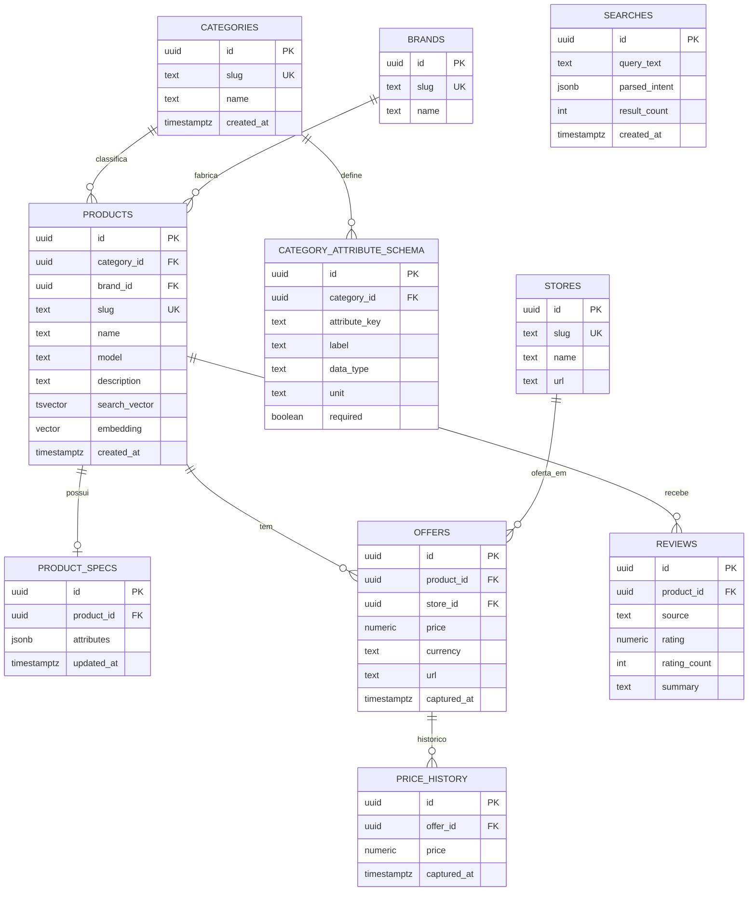

# Modelagem de dados

> **Esquema provisório e aberto** — pode ganhar/perder colunas. Flexibilidade de specs via JSONB (`product_specs.attributes`).

## Princípios

- **Postgres-only**: FTS + pgvector no mesmo banco.
- Specs **category-aware** (`category_attribute_schema`), valores em JSONB.
- Ofertas normalizadas; preço ao longo do tempo em `price_history`.
- Sem `users` no MVP. IDs `uuid`; timestamps `timestamptz`.

## Diagrama ER

`SEARCHES` é um log de consultas (analytics/relevância), sem relação forte com as demais.

## Decisões em aberto

- `product_specs` separado vs. embutido em `products`.
- Granularidade de `reviews`.
- Índices: GIN (FTS/JSONB) e IVFFlat/HNSW (embedding).
- APIFY como possível fonte futura de `offers`/`price_history` (ver ADR-0001).
