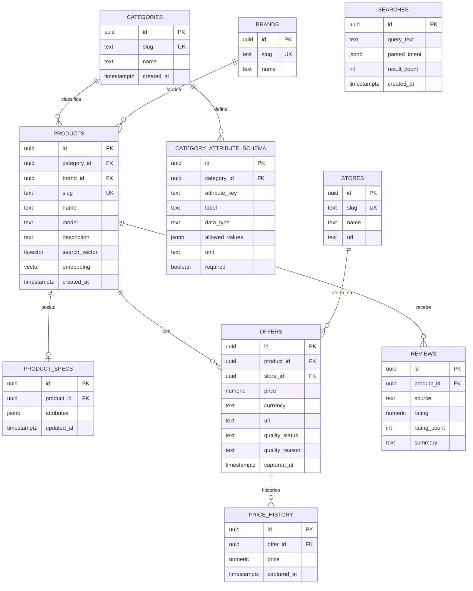

# Modelagem de dados

O esquema é relacional com um ponto de flexibilidade deliberado: as specs do produto vivem
em JSONB (`product_specs.attributes`), porque o conjunto de specs válido depende da
categoria e muda quando uma categoria nova entra.

## Princípios

- **Postgres-only.** FTS e pgvector no mesmo banco, sem datastore adicional (ADR-0002).
- Specs **category-aware**: `category_attribute_schema` declara quais atributos existem por
  categoria, e a validação da ingestão cobra os obrigatórios.
- Ofertas normalizadas, com preço ao longo do tempo em `price_history`.
- Sem `users`: não há autenticação no MVP.
- IDs `uuid`, timestamps `timestamptz`.

## Diagrama ER

```mermaid
erDiagram
  CATEGORIES ||--o{ PRODUCTS : classifica
  CATEGORIES ||--o{ CATEGORY_ATTRIBUTE_SCHEMA : define
  BRANDS ||--o{ PRODUCTS : fabrica
  PRODUCTS ||--o| PRODUCT_SPECS : possui
  PRODUCTS ||--o{ OFFERS : tem
  STORES ||--o{ OFFERS : oferta_em
  OFFERS ||--o{ PRICE_HISTORY : historico
  PRODUCTS ||--o{ REVIEWS : recebe
  CATEGORIES {
    uuid id PK
    text slug UK
    text name
    timestamptz created_at
  }
  CATEGORY_ATTRIBUTE_SCHEMA {
    uuid id PK
    uuid category_id FK
    text attribute_key
    text label
    text data_type
    jsonb allowed_values
    text unit
    boolean required
  }
  BRANDS {
    uuid id PK
    text slug UK
    text name
  }
  PRODUCTS {
    uuid id PK
    uuid category_id FK
    uuid brand_id FK
    text slug UK
    text name
    text model
    text description
    tsvector search_vector
    vector embedding
    timestamptz created_at
  }
  PRODUCT_SPECS {
    uuid id PK
    uuid product_id FK
    jsonb attributes
    timestamptz updated_at
  }
  STORES {
    uuid id PK
    text slug UK
    text name
    text url
  }
  OFFERS {
    uuid id PK
    uuid product_id FK
    uuid store_id FK
    numeric price
    text currency
    text url
    text quality_status
    text quality_reason
    timestamptz captured_at
  }
  PRICE_HISTORY {
    uuid id PK
    uuid offer_id FK
    numeric price
    timestamptz captured_at
  }
  REVIEWS {
    uuid id PK
    uuid product_id FK
    text source
    numeric rating
    int rating_count
    text summary
  }
  SEARCHES {
    uuid id PK
    text query_text
    jsonb parsed_intent
    int result_count
    timestamptz created_at
  }
```

`SEARCHES` é log de consultas (analytics e relevância), sem relação forte com as demais.

## `product_specs.attributes`: três donos, uma coluna

O JSONB de specs é escrito por três caminhos diferentes, e a distinção importa porque já
causou perda silenciosa de dado em produção:

| Chave | Quem escreve | O que é |
| --- | --- | --- |
| Specs da ficha técnica (`ram_gb`, `cpu`, `anc`, ...) | Ingestão do seed | Declaradas em `category_attribute_schema`; as obrigatórias são cobradas na validação |
| `use_case` | Rotulagem offline por LLM (ADR-0010 D2) | Lista de rótulos de um conjunto **fechado**, declarado por categoria em `worker/seed/categories.json`. Em runtime é filtro JSONB comum, sem modelo no caminho |
| `_embedding` | Carga de vetores (`app.search.vector_load`) | Carimbo com `model`, `dim` e `at`. Serve para detectar produto vetorizado por outro modelo |

> **Toda escrita nessa coluna precisa ser merge (`||`), nunca substituição.** Substituir
> `attributes` inteiro apaga o que os outros donos gravaram, sem erro e sem log. Foi
> exatamente o que aconteceu ao recarregar o seed em produção: os rótulos de `use_case`
> sumiram, "notebook" continuou respondendo e "notebook gamer" passou a voltar vazio. O
> defeito está registrado no ADR-0010 e o runbook de recarga do seed inclui o passo de
> re-rotulagem.

## Qualidade de ofertas

`offers.quality_status` classifica a oferta em `valid` ou `rejected`, e `quality_reason`
guarda o motivo em texto livre. A triagem acontece na ingestão, por limite estatístico
dentro da própria categoria; nenhuma oferta é corrigida nem apagada.

Toda leitura que envolve preço (busca, detalhe de produto, comparação) filtra por
`quality_status = 'valid'`. O default da coluna é `valid`, então dado antigo continua
visível. Critério, limites e trade-offs em
[ADR-0012](../adr/0012-qualidade-de-ofertas-na-ingestao.md).

## Índices

| Índice | Onde | Para quê |
| --- | --- | --- |
| GIN sobre `search_vector` | `products` | Full Text Search (RF-10) |
| GIN `jsonb_path_ops` | `product_specs.attributes` | Filtro por atributos com containment `@>` (RF-12) |
| HNSW | `products.embedding` | Busca vetorial, hoje desligada por flag |
| B-tree | `products.category_id`, `products.brand_id`, `offers.store_id`, `price_history.offer_id`, `reviews.product_id` | Junções do caminho de leitura |

A configuração de FTS usa `unaccent` (migration `d2e4f6a8b0c1`). Consulta e documento
precisam passar pela **mesma** configuração: processados por configurações diferentes eles
casam menos e não dão erro, o que é falha silenciosa. Dobrar o acento foi a mudança isolada
que levou a cobertura@5 de 27% para 55%, antes de qualquer IA (ADR-0010 D8).

## Estado das tabelas no MVP

Nem toda tabela vazia é lacuna. A distinção está aqui para que nenhuma seja lida como
esquecimento:

| Tabela ou coluna | Estado | Observação |
| --- | --- | --- |
| `products.embedding` | **Vazia no banco atual** | Medido em 19/09/2026: **0 de 235**. Os 235 vetores da Fase 6 foram carregados em 28/08 no projeto Supabase de `us-east-1`, que foi **substituído** pelo de `sa-east-1` em 18/09. A recriação aplicou migrations, seed e rotulagem de `use_case`, mas não a carga de vetores. Sem impacto hoje, porque `vector_enabled=false`; ligar a busca vetorial exige rodar `python -m app.search.vector_load` antes, ou o retrieval devolve vazio |
| `searches` | **Preenchida** | O `SearchService` grava consulta, intenção interpretada e total de resultados a cada busca com texto. Sem identificação de usuário: não há `users`, nem IP, nem sessão. Falha ao registrar nunca derruba a busca |
| `price_history` | Preenchida pela ingestão | Recebe ponto novo apenas quando o preço muda de verdade, o que mantém a reexecução idempotente |
| `reviews` | **Vazia por decisão** | RF-05 é `Could`. A API do Mercado Livre não expõe avaliação para token de aplicação: `/reviews/item` responde 404, `/products/{id}/reviews` responde 500 e `rating_average` veio nulo em 44 de 44 produtos amostrados. O que destrava é um ator do Apify sobre a página do produto; a coluna `source` existe para distinguir a procedência |

## Identidade do produto

A chave natural é o `slug`, derivado de marca, modelo e SKU do fabricante. Variantes de cor
do mesmo produto (mesmo `parent_id` no catálogo da fonte) são fundidas em um produto só,
somando as ofertas. Detalhe e casos de borda em
[ADR-0009](../adr/0009-enriquecimento-pela-api-e-identidade-do-produto.md) D3.

## Decisões em aberto

- Expurgo por idade em `searches`, que hoje cresce sem limite.
- Granularidade de `reviews`, quando a tabela for povoada.
- `product_specs` separado de `products` continua sendo o desenho; embutir só faria sentido
  se a leitura de specs virasse gargalo, o que não aconteceu.
- Apify como fonte futura de `offers` e `price_history` (ADR-0001).
