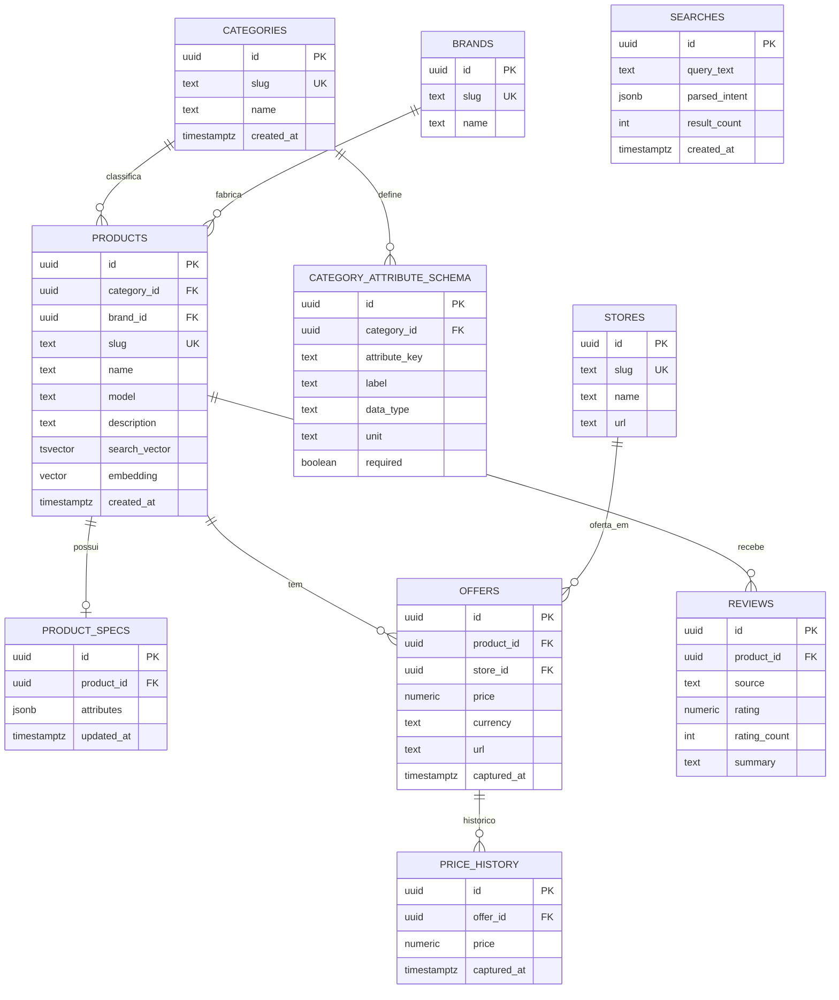

# Modelagem de dados

> **Esquema provisório e aberto** — pode ganhar/perder colunas. Flexibilidade de specs via JSONB (`product_specs.attributes`).

## Princípios

- **Postgres-only**: FTS + pgvector no mesmo banco.
- Specs **category-aware** (`category_attribute_schema`), valores em JSONB.
- Ofertas normalizadas; preço ao longo do tempo em `price_history`.
- Sem `users` no MVP. IDs `uuid`; timestamps `timestamptz`.

## Diagrama ER

```mermaid
erDiagram
  CATEGORIES ||--o{ PRODUCTS : classifica
  CATEGORIES ||--o{ CATEGORY_ATTRIBUTE_SCHEMA : define
  BRANDS ||--o{ PRODUCTS : fabrica
  PRODUCTS ||--o| PRODUCT_SPECS : possui
  PRODUCTS ||--o{ OFFERS : tem
  STORES ||--o{ OFFERS : oferta_em
  OFFERS ||--o{ PRICE_HISTORY : historico
  PRODUCTS ||--o{ REVIEWS : recebe
  CATEGORIES {
    uuid id PK
    text slug UK
    text name
    timestamptz created_at
  }
  CATEGORY_ATTRIBUTE_SCHEMA {
    uuid id PK
    uuid category_id FK
    text attribute_key
    text label
    text data_type
    text unit
    boolean required
  }
  BRANDS {
    uuid id PK
    text slug UK
    text name
  }
  PRODUCTS {
    uuid id PK
    uuid category_id FK
    uuid brand_id FK
    text slug UK
    text name
    text model
    text description
    tsvector search_vector
    vector embedding
    timestamptz created_at
  }
  PRODUCT_SPECS {
    uuid id PK
    uuid product_id FK
    jsonb attributes
    timestamptz updated_at
  }
  STORES {
    uuid id PK
    text slug UK
    text name
    text url
  }
  OFFERS {
    uuid id PK
    uuid product_id FK
    uuid store_id FK
    numeric price
    text currency
    text url
    timestamptz captured_at
  }
  PRICE_HISTORY {
    uuid id PK
    uuid offer_id FK
    numeric price
    timestamptz captured_at
  }
  REVIEWS {
    uuid id PK
    uuid product_id FK
    text source
    numeric rating
    int rating_count
    text summary
  }
  SEARCHES {
    uuid id PK
    text query_text
    jsonb parsed_intent
    int result_count
    timestamptz created_at
  }
```

`SEARCHES` é um log de consultas (analytics/relevância), sem relação forte com as demais.

## Colunas intencionalmente vazias

Nem toda coluna vazia é lacuna. Estas são **estado correto** no MVP — a distinção
está aqui para não serem lidas como esquecimento (ver ADR-0009 D7):

| Onde | Por quê | O que a destrava |
| --- | --- | --- |
| `PRODUCTS.embedding` | O sistema funciona 100% sem IA; a busca vetorial é reforço opcional atrás do `VectorProvider` (ADR-0002) | Fase 6 — `VectorProvider` com pgvector |
| `REVIEWS` (tabela) | RF-05 é `Could` no PRD. A API do ML **não expõe avaliação** para token de aplicação: `/reviews/item` responde 404, `/products/{id}/reviews` responde 500 e `rating_average` veio nulo em 44/44 produtos amostrados | Ator do **Apify** sobre a página do produto (mesma fonte do ADR-0001), colhendo `rating` e `rating_count`. A coluna `source` existe para distinguir a procedência |

`SEARCHES` **deixou de ser vazia**: o `SearchService` registra consulta, intent
interpretado e total de resultados a cada busca com texto. Serve para achar
busca que volta vazia e termo que o `IntentParser` não entende. Gravamos o texto
da consulta **sem identificação de usuário** — não há `users` no MVP, nem IP nem
sessão. Falha ao registrar nunca derruba a busca.

## Identidade do produto

A chave natural é o `slug`, derivado de **marca + modelo + SKU do fabricante**.
Variantes de cor do mesmo produto (mesmo `parent_id` no catálogo da fonte) são
**fundidas em um produto só**, somando as ofertas. Ver ADR-0009 D3.

## Decisões em aberto

- `product_specs` separado vs. embutido em `products`.
- Granularidade de `reviews`.
- Índices: GIN (FTS/JSONB) e IVFFlat/HNSW (embedding).
- APIFY como possível fonte futura de `offers`/`price_history` (ver ADR-0001).
- Expurgo por idade em `searches` (hoje cresce sem limite).
