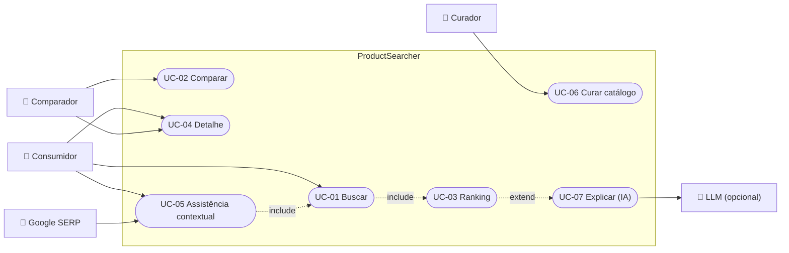
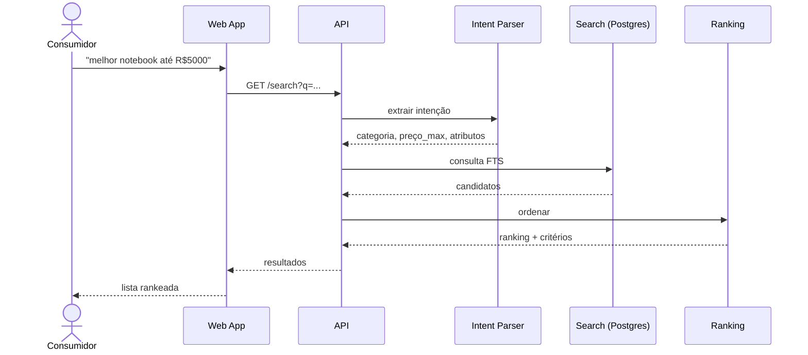
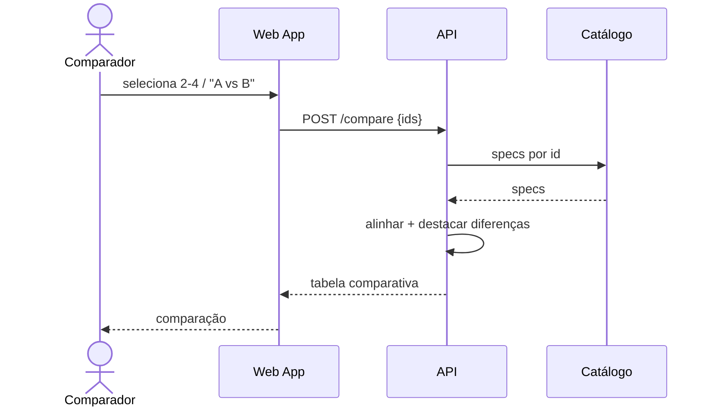
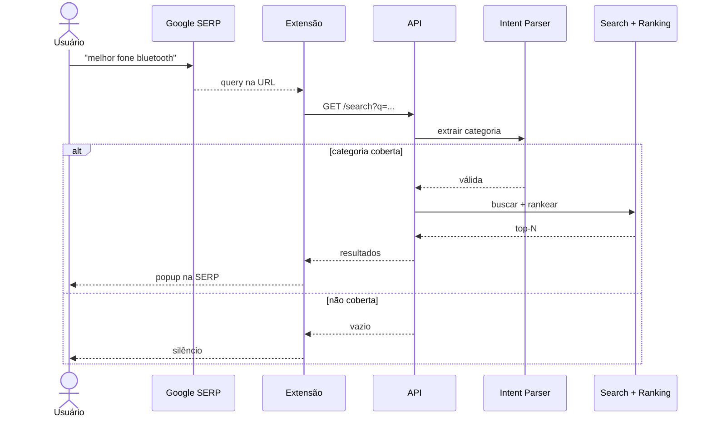
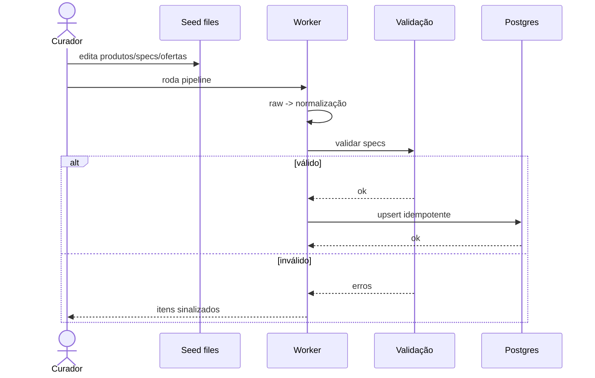

# Casos de uso

> Diagramas em Mermaid (renderizados pelo GitHub/Notion). Complementa o [PRD](prd.md).

## Atores

| Ator | Tipo | Descrição |
| --- | --- | --- |
| Consumidor (topo de funil) | Primário | "melhor X para Y"; não decidiu o modelo |
| Comparador | Primário | "A vs B"; já tem candidatos |
| Curador de catálogo | Interno | Mantém o dataset seed |
| Google SERP | Externo | Origem da query da extensão |
| LLM | Externo (opcional) | Explicações quando habilitado |

## Catálogo de casos de uso

| UC | Nome | Ator | RF |
| --- | --- | --- | --- |
| UC-01 | Buscar produtos | Consumidor | RF-10/11/12 |
| UC-02 | Comparar produtos | Comparador | RF-20/21/22 |
| UC-03 | Ver ranking explicado | Consumidor | RF-30/31 |
| UC-04 | Ver detalhe do produto | Consumidor/Comparador | RF-42 |
| UC-05 | Assistência contextual (extensão) | Consumidor | RF-50/51/52 |
| UC-06 | Curar catálogo (seed) | Curador | RF-70/71/72 |
| UC-07 | Explicar recomendação via IA | Consumidor | RF-61 |

## Diagrama de casos de uso

## UC-01 — Buscar produtos

## UC-02 — Comparar produtos

## UC-05 — Assistência contextual (extensão)

## UC-06 — Curar catálogo (ingestão)

